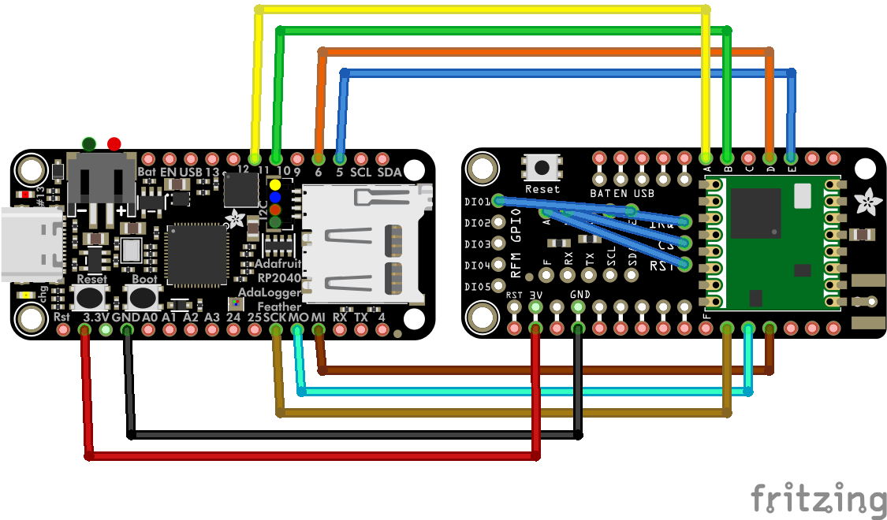
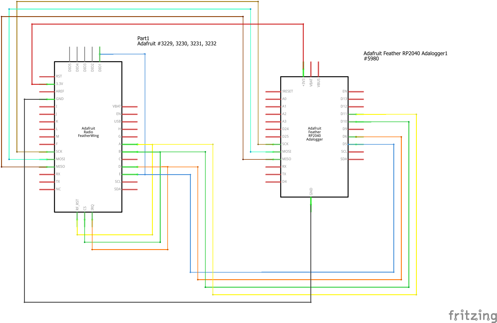

# pico-lorawan (freertos branch)
LoRaWAN for Raspberry Pi Pico / RP2040 with SX1276, using Semtech's LoRaMac-node.

This branch adds FreeRTOS support, US915 focus, reliable confirmed messaging, and a practical OTAA example.

## Hardware

 * RP2040 board
   * [Adafruit Feather RP2040 Adalogger](https://www.adafruit.com/product/5980)
 * Semtech SX1276 board
   * [Adafruit LoRa Radio FeatherWing - RFM95W 900 MHz - RadioFruit](https://www.adafruit.com/product/3231) 

### Default Pinout





GPIO pins are configurable in examples or API.

The `examples/freertos_otaa` example shows an alternate pinout optimized for an Adalogger-style board (SPI1 on GPIO14/15/8, NSS=10, DIO0=6, DIO1=5, RESET=11). Adjust to your hardware.

## Examples

See [examples](examples/) folder.

Each example has a `config.h` to set OTAA/ABP credentials and (for US915) a channel mask.

Notable examples:
- `examples/freertos_otaa`: FreeRTOS-based OTAA app with confirmed uplinks, session persistence, and diagnostics.
- `examples/erase_nvm`: Erases the library’s NVM area (last flash sector) to force a clean join or identity change.

## What’s new in this branch

- FreeRTOS integration: Internal LoRaWAN processing task, semaphore-driven send/join helpers.
- Reliable confirmed messaging: Correct ACK detection based on MCPS-Confirm (no dependency on app-payload downlinks).
- US915-first setup: Region trimmed in examples, with explicit channel mask support (sub-band 0 by default).
- Session persistence: MAC contexts stored in flash; restores on boot and can skip join when valid.
- Diagnostics accessors: `lorawan_get_devaddr`, `lorawan_get_adr_enabled`, `lorawan_last_ack_received`.
- Safer timing and stability: Larger LoRaWAN task stack, malloc/stack hooks enabled in example.

## Quick start (build and run)

Prereqs:
- Pico C/C++ SDK installed and `PICO_SDK_PATH` set
- CMake + Ninja (recommended)

Configure and build (FreeRTOS enabled):

```pwsh
# from repo root
cmake -S . -B build -G Ninja -DUSE_FREERTOS=ON
cmake --build build
```

Flash an example:
- Copy the generated `.uf2` from `build/examples/<example>/` to the Pico in BOOTSEL mode.

Example UF2s of interest:
- `build/examples/freertos_otaa/pico_lorawan_freertos_otaa.uf2`
- `build/examples/erase_nvm/pico_lorawan_erase_nvm.uf2`

## Configure your device (OTAA)

Edit `examples/freertos_otaa/config.h`:
- `LORAWAN_DEVICE_EUI`, `LORAWAN_APP_EUI`, `LORAWAN_APP_KEY`
- US915 channel mask (default sub-band 0): `LORAWAN_CHANNEL_MASK "00FF00000000000000000001"`

Security tip: The example prints keys for debugging—remove those prints for production.

## Erasing Non-volatile Memory (NVM)

This library uses the last page of flash as non-volatile memory (NVM) storage.

You can erase it using the [`erase_nvm` example](examples/erase_nvm), when:

 * Changing the devices configuration
 * If your board is timing out with joining the network

Why this matters: If a valid session is restored on boot, the example will skip OTAA join even if you changed `config.h`. Erase NVM once to force the new identity to take effect.

Programmatic option: Call `lorawan_erase_nvm()` once at boot (guarded by a flag or button) to factory-reset the LoRaWAN contexts.

## Using the FreeRTOS API

The library exposes a small set of FreeRTOS-aware helpers (enabled when `-DUSE_FREERTOS=ON`):

- `int lorawan_join_freertos(uint32_t timeout_ms);`
  - Starts an OTAA join; returns 0 on successful start (then background processing completes the join). Check `lorawan_is_joined()` to confirm joined state.

- `int lorawan_send_confirmed_wait(const void* data, uint8_t len, uint8_t port, uint32_t timeout_ms);`
  - Blocks the caller until TX done and RX windows complete. Returns:
    - `0`: ACK received
    - `-2`: No ACK within RX1/RX2 (timeout/NACK)
    - `-3`: No TX/confirm event within timeout
    - `-1`: Send rejected

- `int lorawan_send_freertos(const void* data, size_t len, uint8_t port, bool confirmed, uint32_t timeout_ms);`
  - Non-blocking transmit helper; returns 0 on success (confirmed/unconfirmed).

Background processing: The library creates an internal LoRaWAN task that services MAC timing (no extra app task required beyond your own logic).

## Diagnostics helpers

- `lorawan_get_devaddr(uint32_t* devaddr)` — fetch current DevAddr from MAC
- `lorawan_get_adr_enabled(int* adr_enabled)` — read ADR state (1/0)
- `lorawan_last_ack_received(void)` — returns 1 if the last confirmed uplink was ACKed

Example output (confirmed uplinks):
- MCPS-Confirm STATUS OK, TX DATA: `CONFIRMED - ACK`, RX1 downlink with no FRMPayload (MAC-only ACK)
- Stable heap and persisted sessions (“CTXS RESTORED … skipping OTAA join”) indicate healthy operation

## Region and channel mask (US915)

The examples target US915 with sub-band 0 (channels 0–7) and RX1 downlinks on the corresponding 500 kHz channel. If your network uses a different sub-band, update `LORAWAN_CHANNEL_MASK` in the example `config.h`.

Server-side, ensure the device profile/region matches (e.g., ChirpStack region `us915_0`).

## Acknowledgements

A big thanks to [Alasdair Allan](https://github.com/aallan) for his initial testing of EU868 support!

This project was created on behalf of the [Arm Software Developers](https://developer.arm.com/) team, follow them on Twitter: [@ArmSoftwareDev](https://twitter.com/armsoftwaredev) and YouTube: [Arm Software Developers](https://www.youtube.com/channel/UCHUAckhCfRom2EHDGxwhfOg) for more resources!

